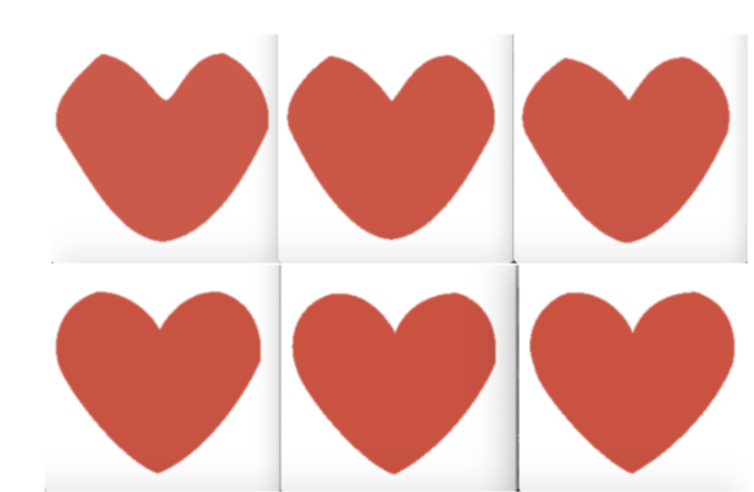

# Image Vectorization through Energy Optimization


This project implements the research paper :

*Effective Clipart Image Vectorization Through Direct Optimization of Bezigons*

## Introduction

Image vectorisation is a crucial subject for many graphic designers who often have to transform a pixelated image into a vector image. 

The implemented algorithm uses "bezigons", i.e. a closed path made up of Bezier curves, to represent the contours of vector shapes.


*Vectorization of a heart clipart using the implemented algorithm*

## Steps
To implement the paper, we proceed according to the following steps:
1. Find a first correct approximation of the image and initialise the bezigons to be optimised.
2. Optimise each of the fragments    of bezigon   according to the equation :
   
   


with :
*   the energy which represents the difference between the original image and the image obtained by rasterizing the bezigon. A major challenge is therefore to find a rasterization function that allows the parameters to be optimised. The function used in the paper uses a discrete wavelet decomposition which gives a differentiable .

*   the energy designed according to pre-established criteria and penalizing bezigons with certain aspects. It can be broken down into 4 energies: 
   -  penalises bezigons that are self-intersecting
   -    penalises small variations in angle, 
   -   penalises handles that are too close to the knots, 
   -   penalises twisted curves that add length to the bezigon. 


## Quick Start


* In a terminal, cd in the "Image_Vectorization" folder
* Clone libigl : 
```js
git clone --recursive https://github.com/libigl/libigl.git
```
* Build the project : 
```js
mkdir build && cd build/
cmake .. && make
```

* Lauch the executable : 
```js
./image_vect <int_nb_steps> <alpha_value> <epsilon_value>  <name_test> <path_image>
```
For example launch :
```js
./image_vect 15 0.0001 1. "test_5" "../data/coeur.jpg"
```
* An image appears 
* CLICK on several points 
* END by pressing 0
* WAIT : The bezier curve will be drawn as well as the rasterized image, and the results will be saved in a svg format.


